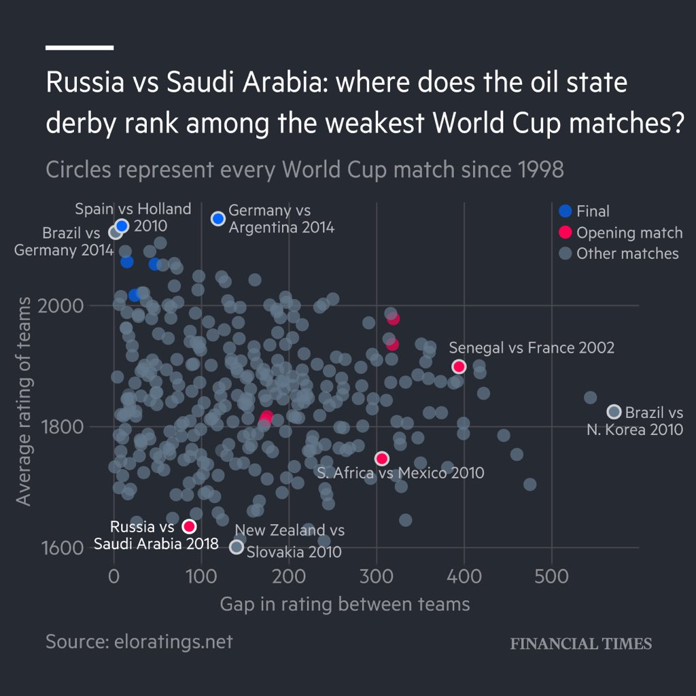
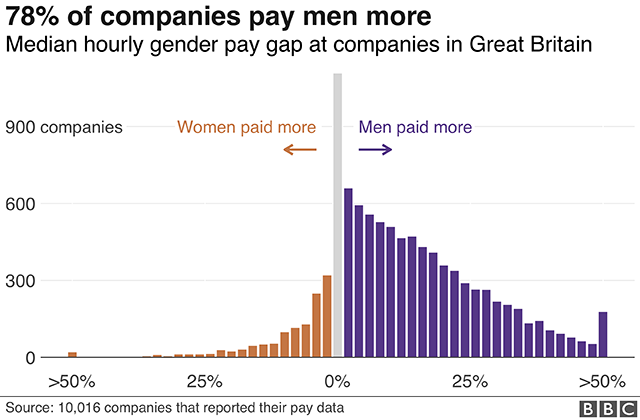
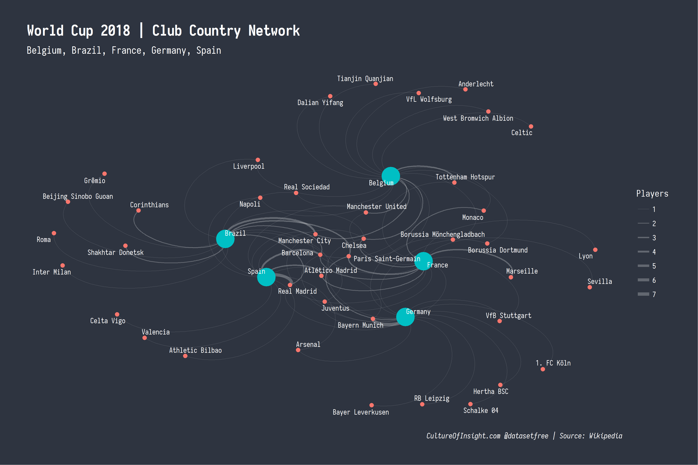
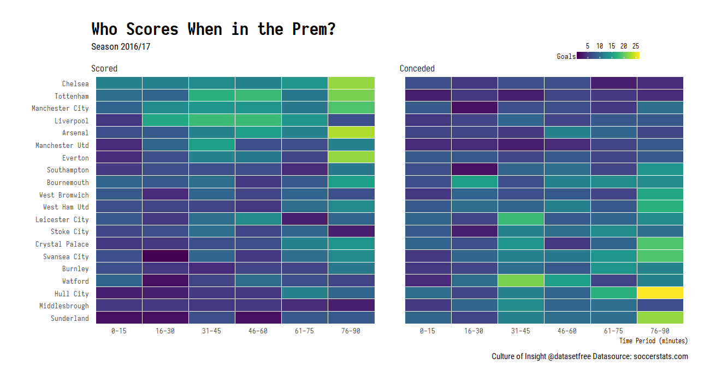
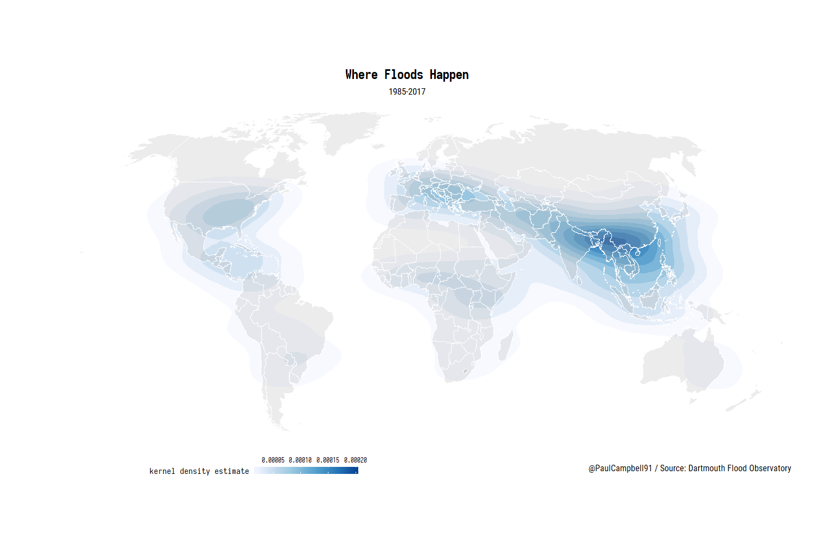
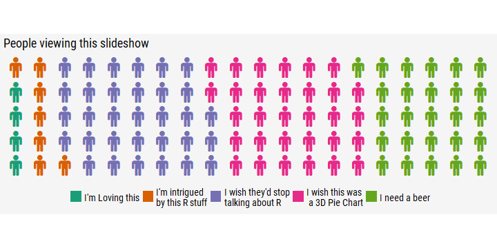

```{r setup, include=FALSE}
options(htmltools.dir.version = FALSE)
```

class: large

# Why ggplot2 for data visualisation?

--


- Combine your data wrangling and chart making into one single process

--

  * no more pasting data from excel into powerpoint to make or change a chart! `r emo::ji("raised_hands")`

--

- Makes it easy to quickly iterate over different ways of mapping your data to shapes, space and colour

--

- Programming a chart with code forces you to think about what you are doing and why

--

- Allows you to create completley unique charts by adding several different 'layers' of data

--

- Not constrained by the chart types available in other software packages

--

- Produce publication quality graphics just like...

---
class: inverse

# Financial Times

<blockquote class="twitter-tweet" data-lang="en"><p lang="en" dir="ltr">Fun fact for the <a href="https://twitter.com/hashtag/dataviz?src=hash&amp;ref_src=twsrc%5Etfw">#dataviz</a> crowd:<br><br>This chart (and the ones in the story) are the first we&#39;ve done 100% in ggplot, right down to the custom <a href="https://twitter.com/FT?ref_src=twsrc%5Etfw">@FT</a> font and the white bar in the top left. <a href="https://t.co/BVFmoYX2WL">https://t.co/BVFmoYX2WL</a></p>&mdash; John Burn-Murdoch (@jburnmurdoch) <a href="https://twitter.com/jburnmurdoch/status/1006783615022391297?ref_src=twsrc%5Etfw">June 13, 2018</a></blockquote>
<script async src="https://platform.twitter.com/widgets.js" charset="utf-8"></script>

.center[

]

---
class: inverse

# BBC

<blockquote class="twitter-tweet" data-conversation="none" data-cards="hidden" data-lang="en"><p lang="en" dir="ltr">At the beeb we’re now doing a lot of charts solely in ggplot. The charts here for example <a href="https://t.co/bokQHQK6pj">https://t.co/bokQHQK6pj</a> .  We’re doing maps too.</p>&mdash; Wesley Stephenson (@WesStephenson) <a href="https://twitter.com/WesStephenson/status/1006797669648470016?ref_src=twsrc%5Etfw">June 13, 2018</a></blockquote>
<script async src="https://platform.twitter.com/widgets.js" charset="utf-8"></script>

.center[

]

---
class: inverse

# Some of our own efforts...

.center[

]

---
class: inverse

# Some of our own efforts...

.center[

]

---
class: inverse

# Some of our own efforts...

.center[

]

---

# Some of our own efforts...

.center[

]

---

# Some of our own efforts...

.center[

]

---

# Some of our own efforts...

.center[

]

---
# Principles

--

> ggplot2 is a system for declaratively creating graphics, based on The Grammar of Graphics. You provide the data, tell ggplot2 how to map variables to aesthetics, what graphical primitives to use, and it takes care of the details.

--

- Relies on 'tidy data' - which we now have!

--

- Each column (variable) of data in your dataset can be 'mapped' to an `aesthetic` on the chart

--

- Aesthetics can include:
 * X-axis
 * Y-axis
 * Colour
 * Fill
 * Alpha (opacity)
 * Groups
 * Loads more!

---

# Quick example

ggplot2 comes with some example datasets - one being `mpg` fuel economy data

```{r message=FALSE, warning=FALSE}
library(ggplot2)

head(mpg)
```

We want to look at the relationship between `displ` (engine displacement in litres) and `hwy` (highway miles per gallon), whilst also differentiating between the `class` of each vehicle.

How would we do it?

---
# Quick example

.left-column[
### Data

```{r eval=FALSE}
* ggplot(data = mpg)
```

]

.right-column[
```{r echo=FALSE}
ggplot(data = mpg)
```
]

---
# Quick example

.left-column[
### Data
### X + Y Aesthetics

```{r eval=FALSE}
ggplot(data = mpg,
       aes(x = displ, #<<
           y = hwy))  #<<
```

]

.right-column[
```{r echo=FALSE}
ggplot(data = mpg,
       aes(x = displ, y = hwy))
```
]

---
# Quick example

.left-column[
### Data
### X + Y Aesthetics
### Geoms

```{r eval=FALSE}
ggplot(data = mpg,
       aes(x = displ,
           y = hwy)) +
  geom_point() #<<
```

]

.right-column[
```{r echo=FALSE}
ggplot(data = mpg,
       aes(x = displ, y = hwy)) +
  geom_point()
```
]

---
# Quick example

.left-column[
### Data
### X + Y Aesthetics
### Geoms
### Colour Aesthetic

```{r eval=FALSE}
ggplot(data = mpg,
       aes(x = displ,
           y = hwy)) + 
  geom_point(aes(colour = class)) #<<
```

]

.right-column[
```{r echo=FALSE}
ggplot(data = mpg,
       aes(x = displ, y = hwy)) +
  geom_point(aes(colour = class))
```
]

---
# Quick example

.left-column[
### Data
### X + Y Aesthetics
### Geoms
### Colour Aesthetic
### Trend Line Geom

```{r eval=FALSE}
ggplot(data = mpg,
       aes(x = displ,
           y = hwy)) + 
  geom_point(aes(colour = class)) +
  geom_smooth() #<<
```

]

.right-column[
```{r echo=FALSE, message=FALSE, warning=FALSE}
ggplot(data = mpg,
       aes(x = displ, y = hwy)) +
  geom_point(aes(colour = class)) +
  geom_smooth()
```
]

---

# ggplot2 Components

.left-column[
## `ggplot()`
]

.right-column[
- Any data or aesthetics declared in the opening `ggplot()` function will be mapped to any following `geom_*` unless overriden within the `geom_*()` function
]

---

# ggplot2 Components

.left-column[
## `ggplot()`
## `geom_*()`
]

.right-column[
- Any data or aesthetics declared in the opening `ggplot()` function will be mapped to any following `geom_*` unless overriden within the `geom_*()` function

- You can map different data and aesthetics to specific geoms by declaring them inside the `geom_*()` function like so: 

```{r eval=FALSE}
geom_point(data = different_dataset, 
           aes(x = xVar, 
               y = yVar, 
               colour = colourVar))
```
]

---

# ggplot2 Components

.left-column[
## `ggplot()`
## `geom_*()`
## + not %>% !!!
]

.right-column[
- Any data or aesthetics declared in the opening `ggplot()` function will be mapped to any following `geom_*` unless overriden within the `geom_*()` function

- You can map different data and aesthetics to specific geoms by declaring them inside the `geom_*()` function like so: 

```{r eval=FALSE}
geom_point(data = different_dataset, 
           aes(x = xVar, 
               y = yVar, 
               colour = colourVar))
```

- Note that to layer elements in a ggplot, we use the `+` operator and not the pipe `%>%`!

]

---
class: inverse, middle, center

# Your Turn!

Let's build some charts with the tidy dataset we made earlier...

